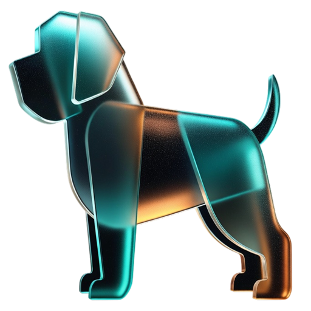

<p align="center">
  <br>
  <br>
  
  <br>
  <br>
</p>

<h1 align="center">
  Bevaka
</h1>

<p align="center">
  <strong>Your screen's faithful guard.</strong>
  <br>
  <sub>A macOS menu bar app that watches over your display<br>while AI agents work.</sub>
</p>

<br>

<p align="center">
  
  &nbsp;&nbsp;
  
  &nbsp;&nbsp;
  
</p>

<br>

---

<br>

> *Bevaka* — Swedish: to guard, to watch over.

Lock your screen. A metallic watchdog appears in a pool of breathing teal light. All input stops. Your agents keep working. When you return — Touch ID, and you're back.

<br>

## ✦ Usage

| | Action | How |
|---|--------|-----|
| 🔒 | Lock | `Cmd+Shift+L` |
| 🔓 | Unlock | Tap → Touch ID |
| ⌨️ | Password | Tap → *password* |
| 🎛️ | Settings | Menu bar → Settings… |

<br>

## ✦ Install

```bash
# Requires Xcode 15+ and XcodeGen
brew install xcodegen

git clone https://github.com/eriknielsen/bevaka.git
cd bevaka
xcodegen generate
xcodebuild -scheme Bevaka -configuration Release build
```

On first launch, grant **Accessibility** when prompted.
That's it. A lock icon appears in your menu bar.

<br>

## ✦ Design

The lock screen is intentionally minimal. Black canvas. Single radial glow. One element at a time.

**Progressive disclosure** — the screen opens with just the watchdog, your message, and a quiet elapsed timer. A single chevron breathes at the bottom. Tap anywhere. Touch ID fades in. Then password below it. Nothing appears without your intent.

**The watchdog** — a metallic origami dog rendered in teal and amber, floating in a pool of light. One shadow. Slow 5-second breathing cycle. The glow moves with it.

**Typography** — semibold message at 0.55 opacity. Monospaced timer at 0.2. The word *password* at 0.18, lowercase, 1.5pt tracking. The screen whispers.

**Animation** — a single 60-second master phase drives everything: the glow radius, the dog's float offset, the chevron's lift. One heartbeat. No competing timers, no visual noise.

**Settings** — hand-built sections with uppercase tracked labels, card backgrounds with hairline borders and 1px shadows. Centered mascot header. Quaternary footer. 380×480, narrower than standard, because the content asked for it.

<br>

## ✦ Under the hood

**Input blocking** — `CGEventTap` intercepts all keyboard, mouse, trackpad, and tablet events system-wide. If macOS disables the tap (timeout), it re-enables *synchronously* in the callback — no async dispatch, no gap.

**Window level** — `CGShieldingWindowLevel()`, the highest level in the system. Above Spotlight, Notification Center, Siri, screen savers, everything.

**Multi-display** — one overlay window per screen, recreated on hot-plug. Fade in at 0.25s. Fade out at 0.5s with ease-out.

**State machine** — `LockState` enum with explicit valid transitions. Every `transitionTo()` call is validated. State is verified again after async authentication returns.

**Sleep prevention** — `IOPMAssertion` keeps the Mac awake. Released on unlock. Released on `deinit`. Logged on failure.

**Auth** — `LAContext.evaluatePolicy(.deviceOwnerAuthentication)` for both Touch ID and password. No hacks, no forced biometric failures, no timeout wrappers. The system dialog handles everything.

<br>

## ✦ Security model

Bevaka is a **visual privacy tool**, not a security boundary.

It guards against the accidental — a colleague, a cat, your own muscle memory while agents run. Not the intentional.

<details>
<summary><strong>What it does</strong></summary>
<br>

- Overlay at highest system window level
- Event tap re-enabled synchronously (no bypass window)
- Fast User Switching cancels auth, keeps lock active
- Accessibility revocation keeps overlay visible (no auto-unlock)
- URL scheme rate-limited (1 call / 0.5s)
- Debug escape hatch compile-gated (`#if DEBUG`)
- State machine validates every transition

</details>

<details>
<summary><strong>What it doesn't do</strong></summary>
<br>

- Prevent `pkill Bevaka`
- Block synthetic events (AppleScript, Accessibility API)
- Survive kernel-level access

For real security: `Ctrl+Cmd+Q`.

</details>

<br>

## ✦ Raycast

Four commands. No view. Instant.

```
Lock Screen           → bevaka://lock
Unlock Screen         → bevaka://unlock
Unlock with Password  → bevaka://unlock-password
Toggle Lock Screen    → bevaka://toggle
```

All unlock commands require authentication.

<br>

## ✦ Architecture

```
Bevaka/
│
├─ BevakApp                     Entry, menu bar, URL scheme
│
├─ Controllers/
│  ├─ LockController            State machine, orchestration
│  ├─ Authenticator             LAContext · Touch ID · password
│  ├─ InputBlocker              CGEventTap · system-wide blocking
│  ├─ OverlayWindowManager      NSWindow · multi-display · fade
│  ├─ HotkeyManager             Carbon · Cmd+Shift+L
│  └─ SleepPreventer            IOKit · idle sleep assertion
│
├─ Views/
│  ├─ LockScreenView            Dog · glow · progressive disclosure
│  ├─ MenuBarView               Dropdown · lock/unlock/quit
│  └─ SettingsView              Cards · toggles · permissions
│
├─ Models/
│  └─ LockState                 .unlocked → .locking → .locked → .unlocking
│
└─ Resources/
   └─ Assets                    Mascot · teal · amber · app icon
```

<br>

---

<p align="center">
  <sub>
    Built with care in Stockholm.
    <br>
    The watchdog is always awake.
  </sub>
</p>

<br>
