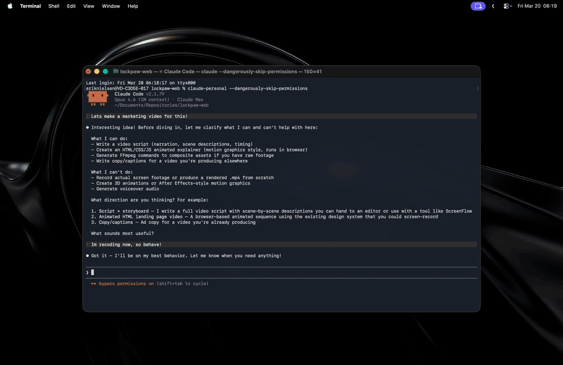

<p align="center">
  <br>
  
  <br>
</p>

<h1 align="center">LockPaw</h1>

<p align="center">
  <strong>Cover your screen with a hotkey. AI agents keep running. Touch ID to unlock.</strong><br>
  <em>Think Tesla Dog Mode — but for your Mac.</em>
</p>

<p align="center">
  <a href="https://getlockpaw.com"></a>
  
  
  
  
  
</p>

<p align="center">
  
</p>

---

> Lock + Paw. Your screen's faithful guard dog.

## Features

- ⌨️ **One hotkey** — lock and unlock with ⌘⇧L (customizable)
- 🔒 **Touch ID unlock** — or password fallback, just like your Mac
- 🖥️ **Every screen covered** — all displays, auto-detects new monitors
- 🤖 **Agents keep running** — AI coding tools, builds, downloads, SSH sessions
- 😴 **Prevents sleep** — IOKit assertion keeps your Mac awake while locked
- 📦 **3.4 MB** — native Swift, no Electron, no frameworks
- 🚫 **No analytics** — no data leaves your Mac, no accounts, no internet required
- 🐕 **The watchdog** — a metallic origami dog in breathing teal light guards your screen

<br>

## Usage

| Action | How |
|--------|-----|
| Lock | Your hotkey (default `Cmd+Shift+L`) |
| Quick unlock | Same hotkey |
| Fallback unlock | Tap screen → Touch ID or password |
| Settings | Menu bar → Settings… |
| Change hotkey | Settings → Shortcuts → click to record |

<br>

## Install

### Download

Grab the latest signed & notarized DMG from [getlockpaw.com](https://getlockpaw.com) or [GitHub Releases](https://github.com/sorkila/lockpaw/releases).

### Homebrew

```bash
brew tap sorkila/lockpaw
brew install --cask lockpaw
```

### Build from source

```bash
brew install xcodegen
git clone https://github.com/sorkila/lockpaw.git
cd lockpaw
xcodegen generate
xcodebuild -scheme Lockpaw -configuration Release build
```

On first launch, grant **Accessibility** when prompted. A dog icon appears in your menu bar.

<br>

## Design

The lock screen is intentionally minimal. Near-black canvas. Subtle radial glow. One element at a time.

**Progressive disclosure** — the screen opens with the watchdog, your message, and a quiet elapsed timer. A chevron breathes at the bottom. Tap anywhere to reveal the fallback auth button. Nothing appears without your intent.

**The watchdog** — a metallic origami dog rendered in teal and amber, floating in a pool of light. Slow 12-second breathing cycle. On successful unlock, the dog scales up with a teal bloom and fades away.

**Typography** — system San Francisco throughout. Regular weight message at 55% white. Monospaced timer at 35%. The screen whispers.

**Auth button** — glass material effect with a subtle border. Visible enough to be tappable, quiet enough to stay out of the way.

<br>

## Under the hood

**Hotkey** — `CGEvent.tapCreate` with `.listenOnly` on a dedicated background thread. Bypasses the LSUIElement activation issue that affects Carbon hotkeys in menu bar apps. Requires Accessibility permission.

**Input blocking** — separate `CGEventTap` intercepts all keyboard, scroll, and tablet events system-wide while locked. Mouse events pass through to the overlay (SwiftUI buttons need clicks). If macOS disables the tap, it re-enables synchronously in the callback.

**Window level** — `CGShieldingWindowLevel()`, the highest level in the system. Above Spotlight, Notification Center, screen savers, everything.

**Multi-display** — one overlay window per screen, recreated on hot-plug.

**State machine** — `LockState` enum with validated transitions. Every `transitionTo()` call is checked. State is verified again after async authentication returns.

**Sleep prevention** — `IOPMAssertion` keeps the Mac awake while locked.

**Auth** — `LAContext.evaluatePolicy(.deviceOwnerAuthentication)` for Touch ID with password fallback. Rate-limited: 30s cooldown after 3 failed attempts.

**Auto-updates** — Sparkle framework checks for updates automatically. Appcast hosted at getlockpaw.com.

<br>

## Security model

Lockpaw is a **visual privacy tool**, not a security boundary.

It guards against the accidental — a colleague, a cat, your own muscle memory while agents run. Not the intentional.

<details>
<summary><strong>What it does</strong></summary>
<br>

- Overlay at highest system window level
- Event tap blocks all keyboard/scroll input
- Fast User Switching cancels auth, keeps lock active
- Accessibility revocation detected and handled (force unlock with warning)
- URL scheme rate-limited (100ms debounce)
- Debug escape hatch compile-gated (`#if DEBUG`)
- State machine validates every transition
- Hotkey conflict detection against system shortcuts

</details>

<details>
<summary><strong>What it doesn't do</strong></summary>
<br>

- Prevent `pkill Lockpaw`
- Block synthetic events (AppleScript, Accessibility API)
- Survive kernel-level access
- Protect against screen recording during overlay fade-in

For real security: `Ctrl+Cmd+Q`.

</details>

<br>

## URL scheme

```
lockpaw://lock              Lock the screen
lockpaw://unlock            Unlock with Touch ID
lockpaw://unlock-password   Unlock with password
lockpaw://toggle            Toggle lock state
```

<br>

## Architecture

```
Lockpaw/
├─ LockpawApp                     Entry, MenuBarExtra, AppDelegate, onboarding
├─ Controllers/
│  ├─ LockController              State machine, lock/unlock orchestration
│  ├─ Authenticator               LAContext · Touch ID · password fallback
│  ├─ InputBlocker                CGEventTap · keyboard/scroll blocking
│  ├─ HotkeyManager              CGEventTap · global hotkey detection
│  ├─ OverlayWindowManager       NSWindow · multi-display · shielding level
│  └─ SleepPreventer             IOKit · idle sleep assertion
├─ Models/
│  ├─ LockState                  .unlocked → .locking → .locked → .unlocking
│  └─ HotkeyConfig               Centralized hotkey UserDefaults access
├─ Views/
│  ├─ LockScreenView             Dog · glow · progressive disclosure
│  ├─ MenuBarView                Dropdown · lock/unlock/quit
│  ├─ SettingsView               Native Form · hotkey recorder · appearance
│  └─ OnboardingView             4-step wizard · hotkey · accessibility
├─ Utilities/
│  ├─ Constants                  Timing, animations, formatting
│  ├─ Notifications              All Notification.Name in one place
│  └─ AccessibilityChecker       AXIsProcessTrusted + System Settings
└─ Resources/
   └─ Assets                     App icon, mascot, menu bar icon, colors
```

<br>

## CI

Pushes to `main` and PRs run build + 34 unit tests via GitHub Actions. Tagged releases (`v*`) build, sign, notarize, and create GitHub Releases with the DMG attached.

<br>

---

<p align="center">
  <sub>
    <a href="https://getlockpaw.com">getlockpaw.com</a>
  </sub>
</p>

<br>
