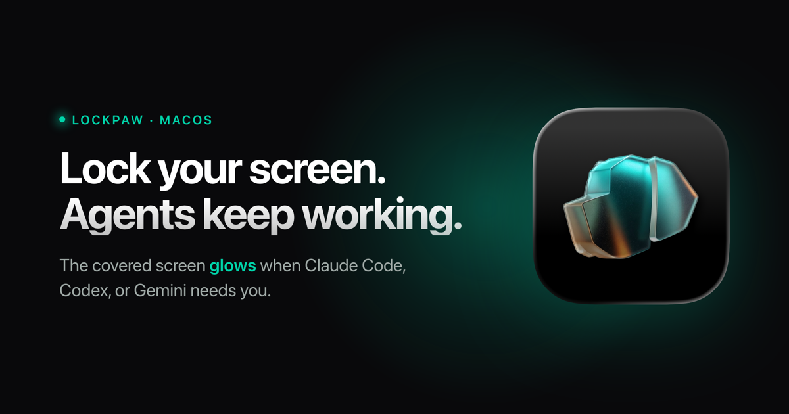

<p align="center">
  
</p>

<h1 align="center">Lockpaw</h1>

<p align="center">
  <strong>One hotkey covers your screen. One hotkey uncovers it. Everything keeps running.</strong><br>
  <em>No sleep. No display disconnect. No process interruption. The screen glows when your agent needs you.</em>
</p>

<p align="center">
  <a href="https://getlockpaw.com"></a>
  <a href="https://github.com/sorkila/lockpaw/actions/workflows/ci.yml"></a>
  <a href="https://github.com/sorkila/lockpaw/releases/latest"></a>
  
  
  
  
</p>

<p align="center">
  
</p>

---

> You could set up Amphetamine, configure Hot Corners, tweak energy settings, and adjust your screen saver. Or you could press ⌘⇧L.

## Features

- **One hotkey.** Lock and unlock with ⌘⇧L, or record your own.
- **Touch ID unlock.** Rest a finger on the sensor, nothing to click first. Password fallback like your Mac.
- **Every screen covered.** All displays, including ones you plug in while locked.
- **Agents keep running.** AI coding tools, builds, downloads and SSH sessions carry on underneath.
- **Agent alerts.** The locked screen glows when Claude Code, Codex, Gemini, Cursor, Copilot or Aider needs you, and the notification says which agent and why.
- **Lid closed, still running.** Optional. Close the MacBook lid while locked and your agents keep going, no external display needed. It uses one small helper you approve once, and sleep comes back when you unlock, when the Mac runs hot, or at 20% battery.
- **Pings on your phone.** Optional. Forward agent pings to ntfy, Pushover or any webhook, such as Home Assistant.
- **Shortcuts and Spotlight.** *Lock Screen* and *Is Lockpaw Locked?* actions. There's no unlock action, on purpose.
- **Fade to black.** Optionally dims the lock screen to pure black after a while (good for OLED) without sleeping the display.
- **Small and native.** About 14 MB of Swift. No Electron.
- **No analytics.** No accounts, and the only network call is the signed update check, plus anything you switch on yourself.
- **Dog, cat, or your own.** Pick the origami dog or cat, drop in your own image, or show no mascot at all.

<br>

## Usage

| Action | How |
|--------|-----|
| Lock | Your hotkey (default `Cmd+Shift+L`) |
| Quick unlock | Same hotkey, or rest a finger on Touch ID |
| Fallback unlock | Click *Authenticate with Touch ID* at the bottom of the lock screen |
| Settings | Menu bar → Settings… |
| Change hotkey | Settings → Shortcuts → click to record |
| Change mascot, use your own image, or turn it off | Settings → Lock Screen → Mascot |
| Hide the menu bar icon | Settings → General → Show menu bar icon (open Lockpaw from Applications to bring it back) |
| Keep agents running with the lid closed | Settings → Lock Screen → Stay awake with the lid closed |
| Send pings to your phone | Settings → Agents → Send pings off this Mac |

<br>

## Agent alerts

Lock your screen and walk away — when your AI agent pauses for permission or finishes,
the locked screen **glows from across the room** and a notification fires. You stay
covered (and private) until *you* unlock. The glow is always silent; turn on a sound in
**Settings → Agents** if you want one (off by default for shared offices). The
notification says who and why: *Claude Code needs permission in my-app*, *Claude Code
finished in other-repo*.

**Easiest:** open **Settings → Agents → Connect your agent** and click your agent —
done. Prefer the terminal? Lockpaw ships a tiny `lockpaw` command-line tool
(`Lockpaw.app/Contents/SharedSupport/lockpaw`); one command wires everything up,
including installing itself into `~/.local/bin` (add `--print` to just see the snippet):

| Agent | Setup | What it hooks |
|-------|-------|---------------|
| **Claude Code** | `lockpaw install-hook claude` | `Notification` + `Stop` + `StopFailure` hooks in `~/.claude/settings.json` (honors `$CLAUDE_CONFIG_DIR`); `Notification` is matched to the types that need you, so `auth_success` and the like stay quiet |
| **Codex CLI** | `lockpaw install-hook codex` | `notify` in `~/.codex/config.toml` for *finished*, plus a `PermissionRequest` hook in `~/.codex/hooks.json` for *waiting* — trust it once via `/hooks` in Codex (honors `$CODEX_HOME`) |
| **Gemini CLI** | `lockpaw install-hook gemini` | `Notification` + `AfterAgent` hooks in `~/.gemini/settings.json` |
| **Cursor** | `lockpaw install-hook cursor` | `stop` hook in `~/.cursor/hooks.json` (`--done`) |
| **Copilot CLI** | `lockpaw install-hook copilot` | `agentStop` + `notification` hooks in `~/.copilot/hooks/lockpaw.json` (honors `$COPILOT_HOME`) |
| **Aider** | `lockpaw install-hook aider` | `notifications-command` in `~/.aider.conf.yml` |
| **Anything else** | append `; lockpaw ping --agent my-tool --done` to your command | runs after your agent finishes (`--waiting` / `--error` for the other two) |

The hooks reference `~/.local/bin/lockpaw` by path, so they work no matter what's on
your PATH, and keep working when the app moves or updates. Re-running `install-hook`
upgrades older hook entries in place; existing foreign hooks are never clobbered, and
a `.bak` backup is saved next to any config it touches. `lockpaw install-cli` is still
there if you just want the command on your PATH.

Under the hood, `lockpaw ping` posts a local notification that Lockpaw listens for — it
never launches the app if it isn't already running.

<br>

## Install

### Download

Grab the latest signed & notarized DMG from [getlockpaw.com](https://getlockpaw.com) or [GitHub Releases](https://github.com/sorkila/lockpaw/releases).

### Homebrew

```bash
brew tap sorkila/lockpaw
brew install --cask lockpaw
```

### Build from source

```bash
brew install xcodegen
git clone https://github.com/sorkila/lockpaw.git
cd lockpaw
xcodegen generate
xcodebuild -scheme Lockpaw -configuration Release build
```

On first launch, grant **Accessibility** when prompted. The Lockpaw icon appears in your menu bar.

<br>

## Design

The lock screen is intentionally minimal. Near-black canvas. Subtle radial glow. One element at a time.

**Calm by default** — the screen opens with your chosen mascot, your message, and a quiet elapsed timer; the pointer slips away after a moment of stillness. The fallback auth button waits quietly at the bottom — always there, never loud. When an agent pings, the screen breathes two slow waves of teal, then keeps a soft "your agent needs you" hint until you return.

**Mascots** — a metallic origami dog or cat rendered in teal and amber, floating in a pool of light. Slow 12-second breathing cycle. On successful unlock, the mascot scales up with a teal bloom and fades away. Or bring your own: a custom image gets a soft feathered edge so it sits in the same pool of light (transparent backgrounds look best).

**Typography** — system San Francisco throughout. Regular weight message at 55% white. Monospaced timer at 35%. The screen whispers.

**Auth button** — glass material effect with a subtle border. Visible enough to be tappable, quiet enough to stay out of the way.

<br>

## Under the hood

**Hotkey** — `CGEvent.tapCreate` on a dedicated background thread. Bypasses the LSUIElement activation issue that affects Carbon hotkeys in menu bar apps. The tap consumes the matched keystroke so it never reaches the app in front. Requires Accessibility permission.

**Input blocking** — a separate `CGEventTap` intercepts keyboard, scroll, tablet and trackpad-gesture events system-wide while locked, including the Dock's own gesture stream, so a three-finger swipe can't slide another Space in. Mouse events pass through to the overlay (SwiftUI buttons need clicks). If macOS disables the tap, it re-enables synchronously in the callback.

**Window level** — `CGShieldingWindowLevel()`, the highest level in the system. Above Spotlight, Notification Center, screen savers, everything.

**Multi-display** — one overlay window per screen, recreated on hot-plug.

**State machine** — `LockState` enum with validated transitions. Every `transitionTo()` call is checked. State is verified again after async authentication returns.

**Sleep prevention** — `IOPMAssertion` keeps the Mac awake while locked. With the lid closed that isn't enough, so the optional `LockpawHelper` LaunchDaemon (registered with `SMAppService`) sets `pmset disablesleep` while locked and clears it on unlock, at boot, and a minute after the app goes away. Its XPC interface is that one switch, and both ends check each other's code signature. See [SECURITY.md](SECURITY.md).

**Auth** — while locked, a biometrics-only `LAContext` is already armed behind the overlay, so the first finger press unlocks with nothing to click. The button path uses `.deviceOwnerAuthentication` for Touch ID with password fallback, rate-limited to a 30s cooldown after 3 failed attempts. A rejected finger on the armed sensor costs no attempt — it may be a palm or a bag strap, and Touch ID enforces its own lockout in hardware.

**Auto-updates** — Sparkle framework checks for updates automatically. Appcast hosted at getlockpaw.com.

<br>

## Security model

Lockpaw is a **visual privacy tool**, not a security boundary.

It guards against the accidental — a colleague, a cat, your own muscle memory while agents run. Not the intentional.

<details>
<summary><strong>What it does</strong></summary>
<br>

- Overlay at highest system window level
- Event tap blocks all keyboard, scroll and trackpad-gesture input
- Quit is refused while locked
- Fast User Switching cancels auth, keeps lock active
- Accessibility revocation detected and handled (force unlock with warning)
- URL scheme rate-limited (100ms debounce)
- Debug escape hatch compile-gated (`#if DEBUG`)
- State machine validates every transition
- Hotkey conflict detection against system shortcuts

</details>

<details>
<summary><strong>What it doesn't do</strong></summary>
<br>

- Prevent `pkill Lockpaw`
- Block synthetic events (AppleScript, Accessibility API)
- Survive kernel-level access
- Protect against screen recording during overlay fade-in

For real security: `Ctrl+Cmd+Q`.

</details>

Found a lock or auth bypass anyway? Please [report it privately](SECURITY.md).

<br>

## URL scheme

```
lockpaw://lock              Lock the screen
lockpaw://unlock            Unlock with Touch ID
lockpaw://unlock-password   Unlock with password
lockpaw://toggle            Toggle lock state
```

<br>

## Architecture

```
Lockpaw/
├─ LockpawApp                     Entry, MenuBarExtra, AppDelegate, onboarding
├─ Controllers/
│  ├─ LockController              State machine, lock/unlock orchestration
│  ├─ Authenticator               LAContext · armed Touch ID · password fallback
│  ├─ InputBlocker                CGEventTap · keyboard/scroll blocking
│  ├─ HotkeyManager               CGEventTap · global hotkey detection
│  ├─ OverlayWindowManager        NSWindow · multi-display · shielding level
│  ├─ SleepPreventer              IOKit · idle sleep assertion
│  ├─ LidSleepController          Lid-closed mode · SMAppService helper · XPC · power cutouts
│  ├─ WebhookRelayController      Optional ping relay · ntfy / Pushover / webhook · Keychain
│  └─ AgentNotifier               UNUserNotificationCenter · agent-ping notifications
├─ Models/
│  ├─ LockState                  .unlocked → .locking → .locked → .unlocking
│  ├─ HotkeyConfig               Centralized hotkey UserDefaults access
│  ├─ PingDecision               Pure agent-ping decision (pulse/notify/sound)
│  ├─ PassiveAuthPolicy          Pure armed-Touch-ID rules (arm/re-arm/stand down)
│  ├─ AgentPing                  Typed ping: hook payload → agent · project · kind (shared with the CLI)
│  ├─ LockdownPolicy             Pure gesture lockdown (Space swipes)
│  ├─ LidSleepPolicy             Pure lid-closed rules (thermal, battery) + macOS lock handling
│  ├─ WebhookRelay               Pure relay request builder + per-session throttle
│  ├─ SupporterLicence           Polar key check · supporter state
│  ├─ Mascot                     Dog/cat/custom/none lock screen preference (+ supporter mascots, seasonal skins)
│  └─ TerminationPolicy          Quit is refused while guarded (+ LockStatus mirror)
├─ Views/
│  ├─ LockScreenView             Mascot (dog/cat/custom) · agent-ping glow · fallback auth
│  ├─ AmbientScreenView          Secondary display gradient animation
│  ├─ MenuBarView                Dropdown · lock/unlock/quit
│  ├─ SettingsView               Native tabs · hotkey recorder · updates
│  └─ OnboardingView             5-step wizard · hotkey · accessibility · agent alerts
├─ Utilities/
│  ├─ Constants                  Timing, animations, formatting
│  ├─ Notifications              All Notification.Name in one place
│  └─ AccessibilityChecker       AXIsProcessTrusted + System Settings
└─ Resources/
   └─ Assets                      App icon, mascot, menu bar icon, colors

LockpawCLI/
└─ main                           `lockpaw` CLI · ping · install-cli · install-hook

LockpawHelper/                    Lid-closed mode's root LaunchDaemon (opt-in) · one XPC call: sleep on/off
```

<br>

## CI

Pushes to `main` and PRs run the build and the full unit test suite via GitHub Actions. Shipped DMGs are Developer ID-signed, notarized, and published to [GitHub Releases](https://github.com/sorkila/lockpaw/releases); auto-updates are delivered through Sparkle with EdDSA-signed appcasts.

<br>

## Support

Everything in Lockpaw is free and MIT-licensed, and everything that ships stays free. No feature is ever moved behind a payment.

If Lockpaw earns its place on your Mac, you can [sponsor me on GitHub](https://github.com/sponsors/sorkila), [buy me a coffee](https://www.buymeacoffee.com/eriknielsen), or [become a supporter](https://getlockpaw.com/support/) (pay what you want). Supporters get a few thank-yous: four extra mascots, seasonal skins for the Dog and Cat, and no once-a-year "consider supporting" line in the menu. Contributors get a supporter licence on the house.

<br>

## Pairs with

[**Tintpad**](https://tintpad.com) is the other half of the loop: one hotkey opens your terminal at the right repo with Claude Code, Codex, or any agent already running. Tintpad starts your agents. Lockpaw covers for you while they run. Also free, also MIT.

<br>

---

<p align="center">
  <sub>
    <a href="https://getlockpaw.com">getlockpaw.com</a>
  </sub>
</p>

<br>
